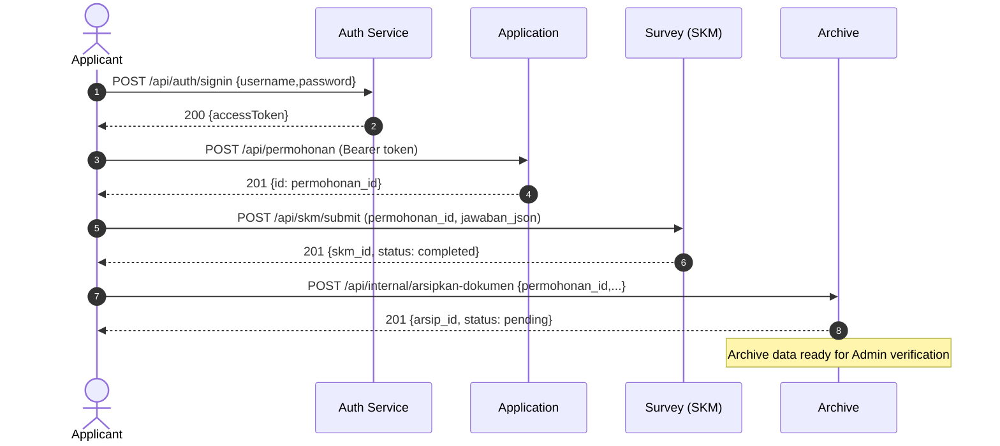
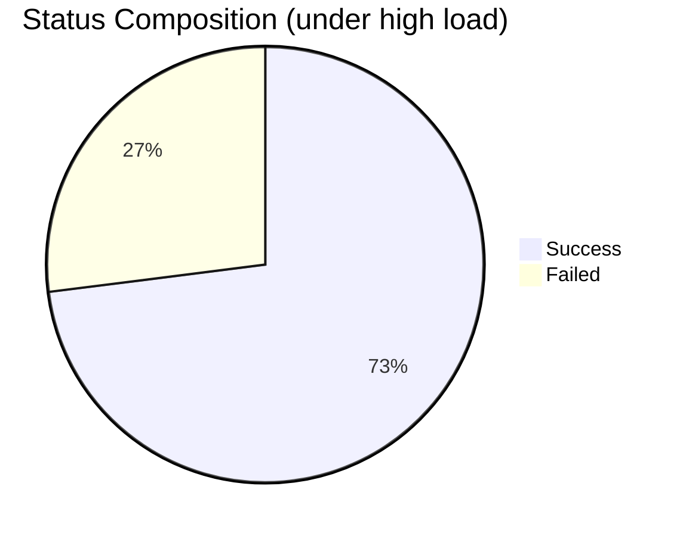

# Jelita Microservices Testing & Evaluation Report

- Date: Nov 13, 2025
- Environment: Windows + Docker Desktop, PowerShell, Node.js 18, MySQL 8.0
- Service Stack: Auth, Application, Workflow, Survey (SKM), Archive

## Executive Summary
- **Objective**: Validate functionality, inter-service interoperability, and basic scalability testing (baseline vs stress).
- **Key Results**:
  - **Functional**: All main flows working (signin → application → submit SKM → archive → verification).
  - **Interoperability**: JWT tokens used across services; `permohonan_id` reference consistent from Application → Survey → Archive.
  - **Baseline** (10 VUs, ~1m40s): p95 160 ms, ~52.7 req/s, error 6.68% (mainly 404 on archive read when data not yet available).
  - **Stress** (up to 300 VUs, ~7m): p95 9.64 s, error 26.85%, bottleneck on login (p95 11.55 s) and internal archive endpoint (EOF under high load).

## Test Environment
- Docker Compose with 7 containers: `mysql`, `phpmyadmin`, `auth`, `application`, `workflow`, `survey`, `archive`.
- Ports: MySQL host 3307→container 3306; services: 3001/3010/3020/3030/3040; phpMyAdmin 8080.
- Database per service: `jelita_users`, `jelita_pendaftaran`, `jelita_workflow`, `jelita_survei`, `jelita_arsip`.
- Summary data (end of session): Users=4, Applications=1, SKM=1, Archives=4810.

## Functional Validation
- Auth: `POST /api/auth/signin` returns `accessToken` (JWT) with payload `{id, role}`.
- Application: `POST /api/permohonan` creates application ID 1 (stores `data_pemohon`).
- Survey: `POST /api/skm/submit` accepts `permohonan_id=1` and `jawaban_json`, status `completed` saved.
- Archive: `POST /api/internal/arsipkan-dokumen` creates archive (no auth, internal), `GET /api/arsip/:id` requires Admin/OPD/Pimpinan role.

### Endpoint Status Table (manual test sample)
| Service | Endpoint | Method | Auth | Result |
|---|---|---|---|---|
| Auth | `/api/auth/signin` | POST | - | 200, `accessToken` ✓ |
| Application | `/api/permohonan` | POST | Bearer | 201, ID=1 ✓ |
| Survey | `/api/skm/submit` | POST | Bearer (Applicant) | 201, SKM ID=1 ✓ |
| Archive | `/api/internal/arsipkan-dokumen` | POST | - | 201, Archive ID incremented ✓ |
| Archive | `/api/arsip/1` | GET | Bearer (Admin) | 200, archive data ✓ |

## Interoperability (Cross-Service Flow)


## Load Test — Baseline (k6)
- Scenario: 10 VUs, ~1m40s, health check + signin + simple archive read.
- **Reasoning for baseline 10 VUs configuration**:
  - Simulates normal daily usage (5-15 concurrent users realistic for government licensing applications)
  - Baseline performance characteristics of system without stress to determine performance budget
  - Validation that system can handle minimal load with acceptable response time (target p95 < 500ms)
  - Benchmark for comparison with stress test results (performance degradation factor)
- Main results:
  - Throughput: ~52.7 req/s
  - p95 `http_req_duration`: ~160 ms
  - Error rate: ~6.68% (mainly from 404 `GET /api/arsip/1` when data not yet available in some iterations)

| Metric | Value |
|---|---|
| VUs | 10 |
| Duration | 1m40s |
| Request/s | ~52.7 |
| p95 Latency | ~160 ms |
| Error Rate | ~6.68% |

Note: After endpoint fixes (`/signin`, `accessToken`), functional errors decreased; remaining 404s are expected on limited data.

## Load Test — Stress (k6)
- Scenario: gradual ramp up to 300 VUs (~7m); trigger internal archive, login, and read archive.
- **Reasoning for stress 300 VUs configuration**:
  - Simulates peak/viral load (e.g., new policy announcement, mass licensing deadline)
  - Identifies bottlenecks and breaking point of system before total failure
  - 300 VUs = ~30x baseline to measure significant performance degradation
  - Practical limitation: single-host development environment (laptop/desktop) with limited resources
  - Validates whether system can gracefully degrade vs crash under pressure
  - 7-minute timeline allows gradual ramp-up (0→300 VUs) to observe behavior patterns
- Main results (summarized from k6 logs):
  - Total Requests: ~22,170 (±52.65 req/s)
  - p95 `http_req_duration`: ~9.64 s
  - Error Rate: ~26.85%
  - p95 `login_duration`: ~11.55 s (indicates login or DB/IO bottleneck)
  - p95 `archive_duration`: ~403 ms (archive part relatively fast; `EOF` errors appear under high load)

| Metric | Value |
|---|---|
| VUs max | 300 |
| Duration | ~7m |
| Total Requests | ~22,170 |
| Request/s | ~52.65 |
| p95 Latency | ~9.64 s |
| Error Rate | ~26.85% |
| p95 Login | ~11.55 s |
| p95 Archive | ~403 ms |

Visual summary of error proportion (estimated):


## Performance Observations & Bottlenecks
### Load Level Selection Methodology
- **Baseline (10 VUs)**: Represents normal usage of government licensing application with 5-15 concurrent users. Target p95 < 500ms to ensure good user experience under normal conditions.
- **Stress (300 VUs)**: Simulates extreme conditions (30x baseline) to identify breaking points and bottlenecks before system collapse. Number 300 chosen because:
  - High enough to trigger resource contention and queue buildup
  - Still within reasonable bounds for single-host development environment
  - Provides sufficient gradient to see performance degradation patterns
  
### Bottleneck Findings
- Login becomes bottleneck under high load (p95 > 10 s). Potential causes:
  - Bcrypt hashing without concurrency limit configuration.
  - Limited DB connections/default pooling not optimized.
  - No cache for profile/user claims.
- Internal archive endpoint occasionally fails with `EOF` under high load → indicates running out of connections, upstream timeout, or backpressure not configured.
- Resource snapshot (during test): MySQL ~417 MB RAM, CPU ~2–5%; Node services RAM 35–80 MB; shows bottleneck is not CPU-bound but I/O/external latency.

## Interoperability Evaluation
- Cross-service authentication via JWT: valid and verified across Application/Survey/Archive.
- Cross-DB entity references: `permohonan_id` from Application used in Survey and Archive without inconsistency.
- Access rights: `GET /api/arsip/:id` restricted by role; Applicant access attempts rejected as designed (requires Admin/OPD/Pimpinan).

## Improvement Recommendations
- Service scalability:
  - Add gateway/load balancer (Nginx/Traefik) so scaling `auth` and other services can utilize multiple replicas (current single host port limits effective scaling).
  - Enable explicit connection pooling (Sequelize: `pool.max`, `acquire`, `idle`) and increase MySQL `max_connections` if safe.
  - Rate limit and internal queue for `internal/arsipkan-dokumen` endpoint to avoid `EOF`/timeout on high bursts.
  - Reduce login cost: configure balanced `bcrypt` cost factor or use worker threads; add session/claims cache (Redis) for read-heavy loads.
  - Observability: add tracing (OpenTelemetry), metrics (Prometheus), and log correlation across services.
- Interoperability:
  - Add contract tests (Pact) between services.
  - Internal endpoints should be backed by message broker (RabbitMQ/Kafka) for better load tolerance and reliability.

## Quick Reproduction Steps (PowerShell)
```powershell
# 1) Run stack
docker-compose up -d --build

# 2) Initialize all service databases
.\docker\setup-databases.ps1

# 3) Login (Applicant)
Invoke-RestMethod -Uri "http://localhost:3001/api/auth/signin" -Method POST -ContentType "application/json" -Body '{"username":"pemohon_demo","password":"demo123"}'

# 4) Create application
$token = '<APPLICANT_ACCESS_TOKEN>'
$perm = @{user_id=1; data_pemohon=@{jenis_izin="SIPPT"; nama="Pemohon Demo"}} | ConvertTo-Json -Depth 3
Invoke-RestMethod -Uri "http://localhost:3010/api/permohonan" -Method POST -Headers @{Authorization="Bearer $token"} -ContentType "application/json" -Body $perm

# 5) Submit SKM
$skm = @{permohonan_id=1; user_id=1; jawaban_json=@{nilai_1=4;nilai_2=5}} | ConvertTo-Json -Depth 3
Invoke-RestMethod -Uri "http://localhost:3030/api/skm/submit" -Method POST -Headers @{Authorization="Bearer $token"} -ContentType "application/json" -Body $skm

# 6) Archive (internal)
Invoke-RestMethod -Uri "http://localhost:3040/api/internal/arsipkan-dokumen" -Method POST -ContentType "application/json" -Body '{"permohonan_id":1,"nomor_izin":"SIPPT/001/2025"}'

# 7) k6 baseline
cd tests; k6 run loadtest-baseline.js

# 8) k6 stress (saves raw events JSON)
k6 run loadtest-stress.js --out json=stress-results.json
```

## Appendices
- Artifacts: `tests/stress-results.json` (raw k6 stress test events).
- Test scripts: `tests/loadtest-baseline.js`, `tests/loadtest-stress.js`, `tests/test-e2e-integration.js`.
- Health endpoints: all services have `GET /health` for readiness checks.

---
**Conclusion**: Microservices implementation is functionally end-to-end with good interoperability. At baseline, performance is responsive; under stress, main bottlenecks are login and internal archive under high load. Optimization and scaling architecture (gateway, pooling, broker) recommended before further scale testing.
